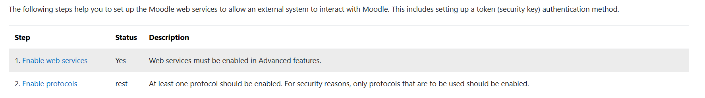

crear archivo configuracion en sites-enabled laragon 
moodle.conf
en la configuracion agregar 
```xml
<VirtualHost *:80>
    DocumentRoot "C:/laragon/www/moodle/public"
    ServerName moodle.test
    ServerAlias *.moodle.test
    <Directory "C:/laragon/www/moodle/public">
        AllowOverride All
        Require all granted
    </Directory>
</VirtualHost>
```

ahora abrir moodle.test en el navegador. debe aparecer los pasos de instalacion


-- modificar php.ini
```php
max_input_vars = 6000
```
# habilitar servicios web y rest protocol
1. site administration
2. server
3. Web service -> overview


## creacion de api mobile
1. crear un nuevo servicio externo
2. nombre de preferencia api_mobile
3. agregar functions

## agregar permisos al usuario admin

1. users/permission/define roles
2. webservice/rest:use
3. moodle/webservice:createtoken
